# Architecture Documentation

This document provides a detailed architectural overview of deploying the official Neo4j MCP (Model Context Protocol) server to Azure and extending it for Databricks integration.

## Table of Contents

- [Overview](#overview)
- [Neo4j MCP Server](#neo4j-mcp-server)
  - [Core Architecture](#core-architecture)
  - [Available Tools](#available-tools)
  - [Transport Modes](#transport-modes)
  - [Authentication](#authentication)
- [Azure Deployment](#azure-deployment)
  - [Resource Architecture](#resource-architecture)
  - [Container Architecture](#container-architecture)
  - [Security Model](#security-model)
  - [Deployment Flow](#deployment-flow)
- [Databricks Extension](#databricks-extension)
  - [Unity Catalog Integration](#unity-catalog-integration)
  - [Agent Deployment](#agent-deployment)
- [Request Flows](#request-flows)

---

## Overview

This project deploys the official Neo4j MCP server to Azure Container Apps, enabling AI agents to securely query Neo4j graph databases through the standardized Model Context Protocol. The architecture supports multiple client types including Claude Desktop, custom LangGraph agents, and Databricks notebooks.

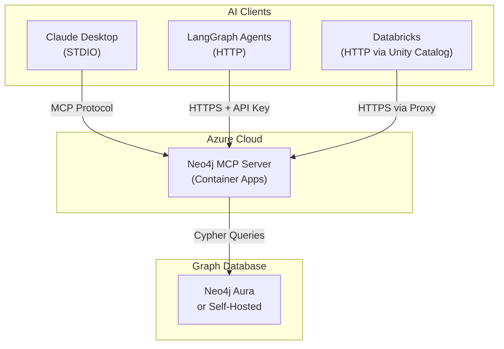

---

## Neo4j MCP Server

The official Neo4j MCP server is a Go application that implements the Model Context Protocol, enabling AI agents to interact with Neo4j databases through a standardized interface.

### Core Architecture

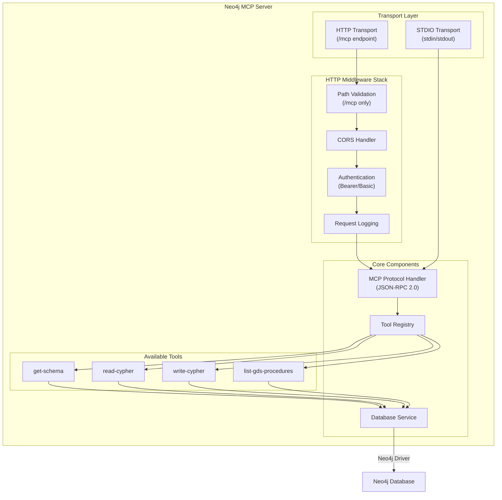

### Available Tools

The MCP server exposes four tools for interacting with Neo4j:

| Tool | Description | Read-Only | Parameters |
|------|-------------|-----------|------------|
| `get-schema` | Retrieves database schema (labels, relationships, properties) | Yes | None |
| `read-cypher` | Executes read-only Cypher queries | Yes | `query`, `params` (optional) |
| `write-cypher` | Executes write Cypher queries (disabled in read-only mode) | No | `query`, `params` (optional) |
| `list-gds-procedures` | Lists available Graph Data Science procedures | Yes | None |

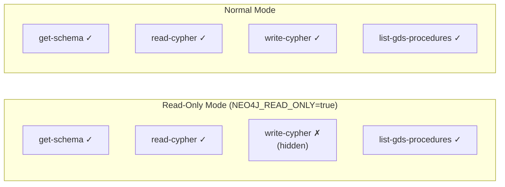

### Transport Modes

The server supports two transport modes:

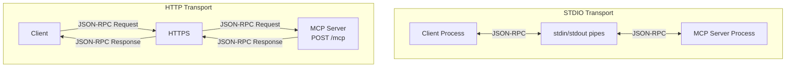

| Aspect | STDIO | HTTP |
|--------|-------|------|
| Use Case | Desktop clients (Claude, VSCode) | Web clients, Multi-tenant |
| Credentials | Environment variables at startup | Per-request headers + env fallback |
| Startup Verification | Mandatory | Skipped if no env credentials |
| Multi-tenant | No | Yes |

### Authentication

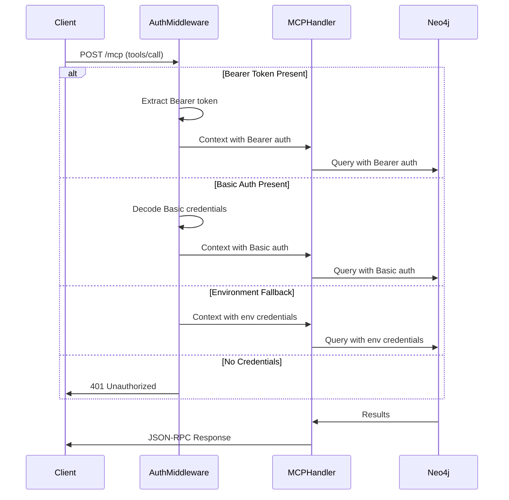

---

## Azure Deployment

### Resource Architecture

The deployment creates the following Azure resources:

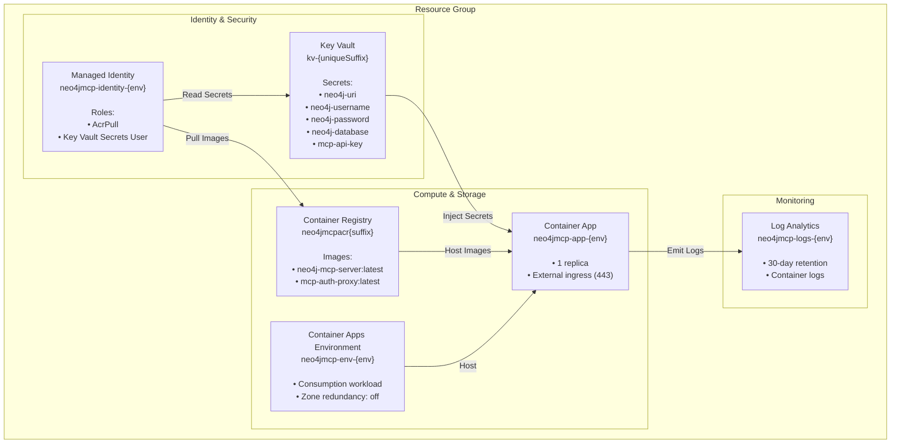

### Container Architecture

The Container App runs two sidecar containers:

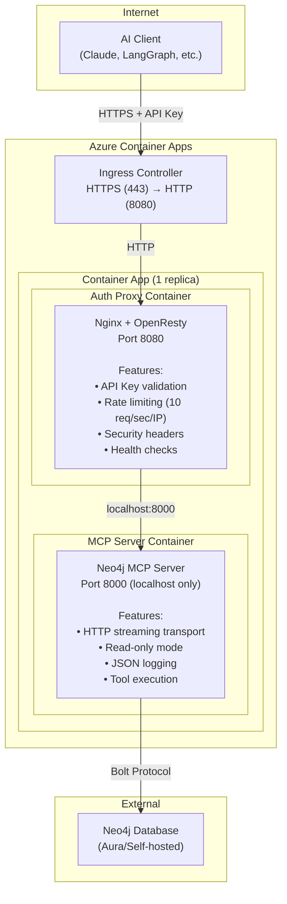

### Security Model

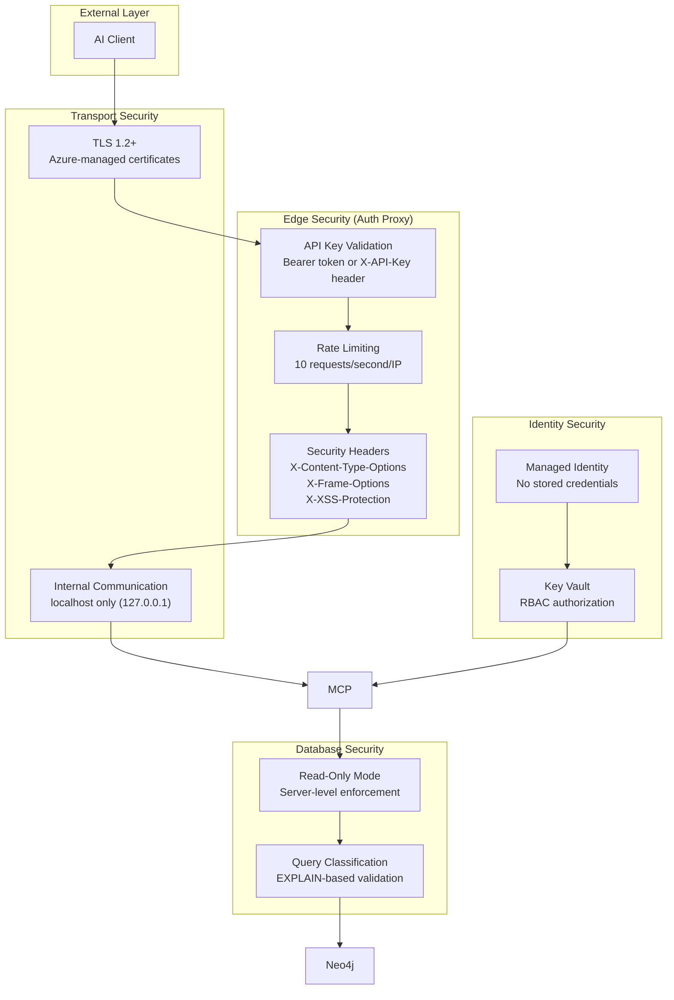

**Security Layers:**

1. **Transport Security**: TLS 1.2+ enforced by Azure Container Apps
2. **API Authentication**: Bearer token or X-API-Key header validated by Nginx
3. **Rate Limiting**: 10 requests/second per IP (configurable)
4. **Request Protection**: 1MB max body, security headers
5. **Network Isolation**: MCP server listens only on localhost
6. **Secret Management**: Key Vault with RBAC, managed identity access
7. **Query Protection**: Read-only mode, EXPLAIN-based query classification

### Deployment Flow

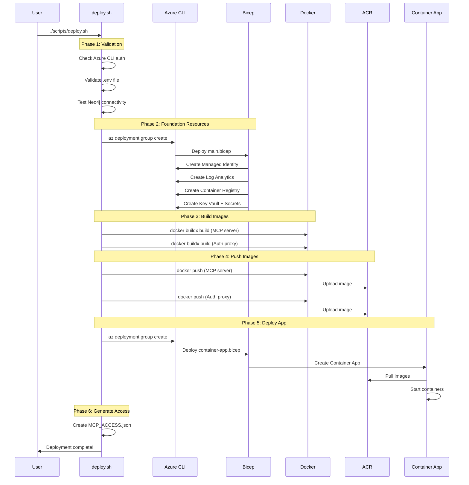

---

## Databricks Extension

### Unity Catalog Integration

The architecture extends to Databricks through Unity Catalog HTTP connections:

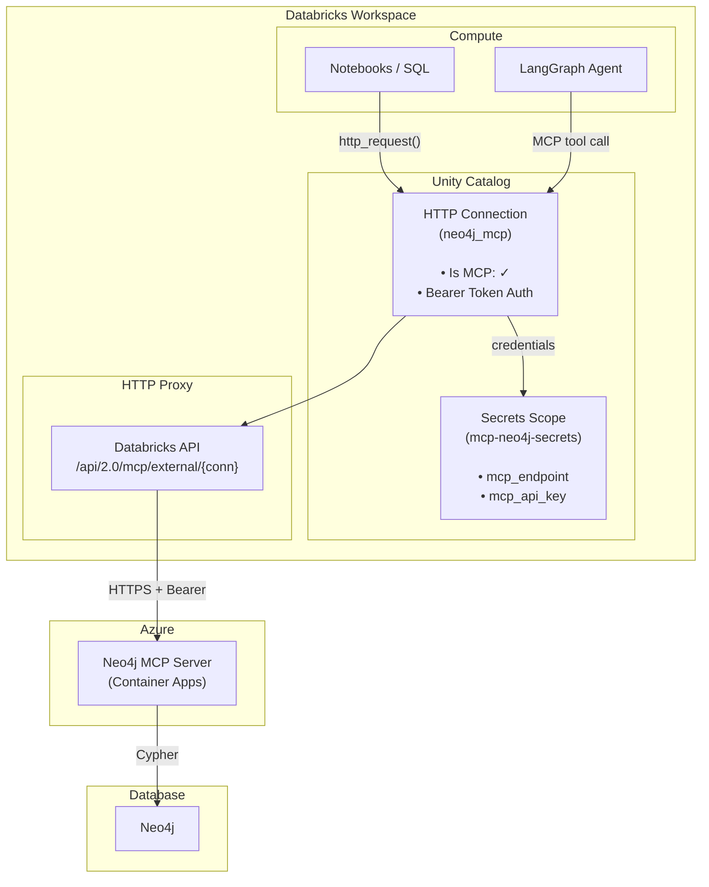

### Request Flow Through Databricks

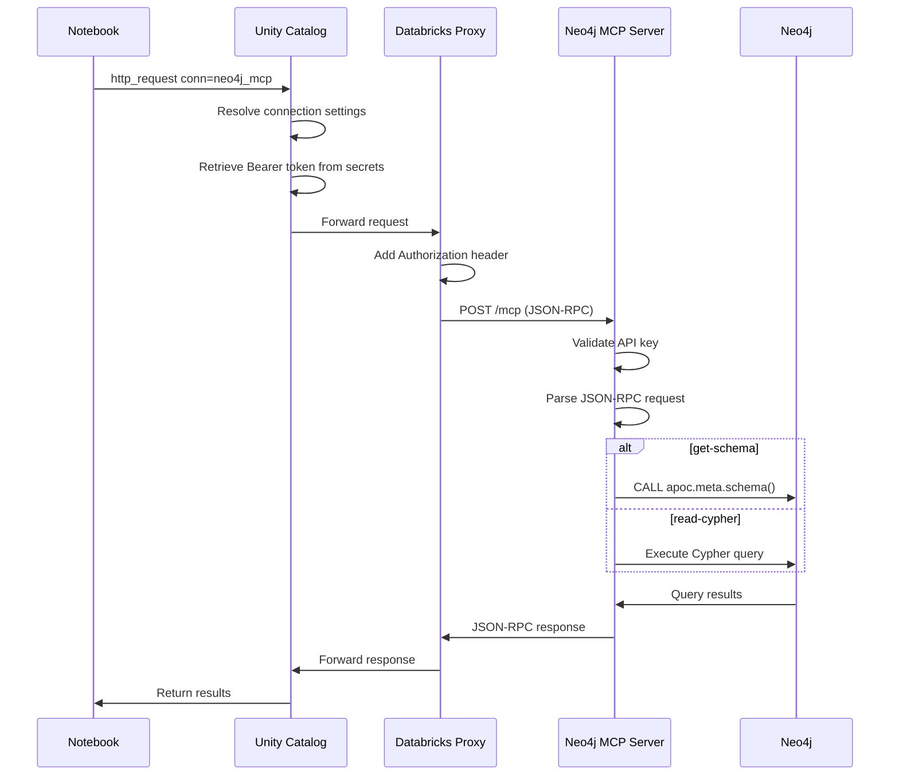

### Agent Deployment

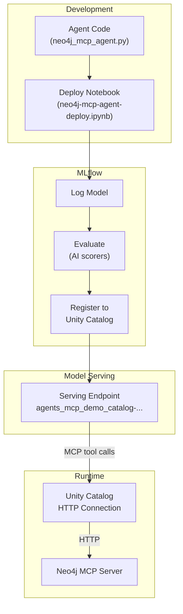

**Deployment Steps:**

1. **Test Agent**: Verify connectivity to Neo4j via MCP
2. **Log to MLflow**: Package as ResponsesAgent model
3. **Evaluate**: Run quality assessments with MLflow scorers
4. **Register**: Store in Unity Catalog for governance
5. **Deploy**: Create serving endpoint

---

## Request Flows

### Direct HTTP Client (LangGraph, Custom)

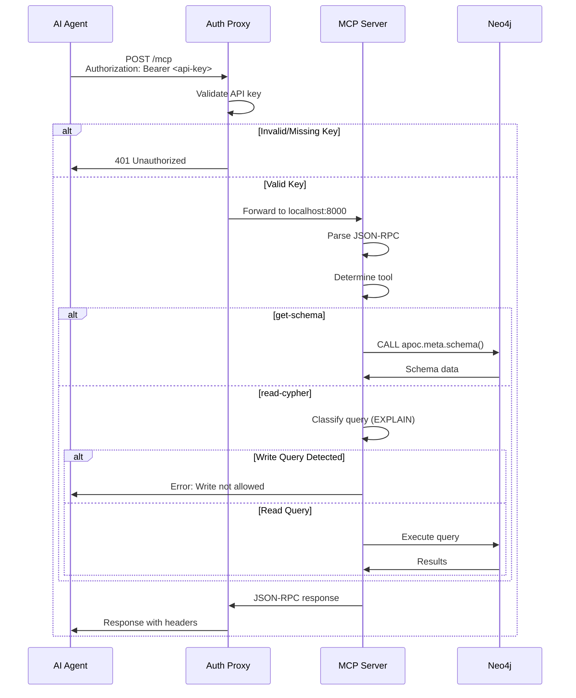

### MCP Protocol Messages

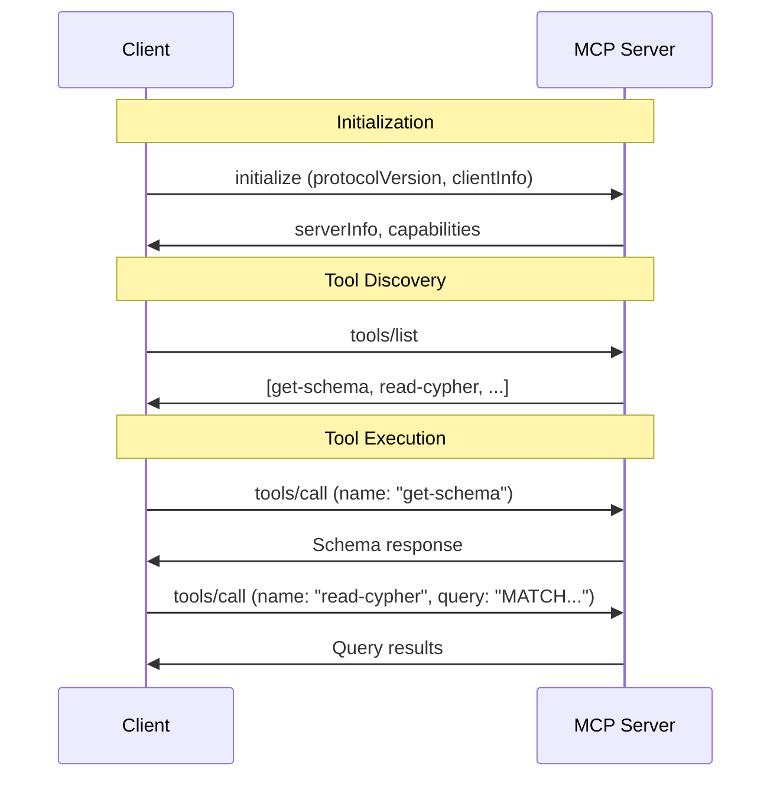

---

## Configuration Reference

### Environment Variables

| Variable | Required | Default | Description |
|----------|----------|---------|-------------|
| `NEO4J_URI` | Yes (STDIO) | - | Neo4j connection URI |
| `NEO4J_USERNAME` | Yes (STDIO) | - | Database username |
| `NEO4J_PASSWORD` | Yes (STDIO) | - | Database password |
| `NEO4J_DATABASE` | No | `neo4j` | Target database |
| `NEO4J_READ_ONLY` | No | `false` | Enable read-only mode |
| `NEO4J_MCP_TRANSPORT` | No | `stdio` | Transport mode (`stdio`/`http`) |
| `NEO4J_MCP_HTTP_HOST` | No | `127.0.0.1` | HTTP bind address |
| `NEO4J_MCP_HTTP_PORT` | No | `80`/`443` | HTTP port |
| `NEO4J_LOG_FORMAT` | No | `text` | Log format (`text`/`json`) |
| `NEO4J_LOG_LEVEL` | No | `info` | Log verbosity |
| `MCP_API_KEY` | Yes | - | API key for auth proxy |

### Azure Resources

| Resource | SKU/Tier | Monthly Cost |
|----------|----------|--------------|
| Container Apps | Consumption (1 replica) | $15-30 |
| Container Registry | Basic | $5 |
| Key Vault | Standard | ~$0.50 |
| Log Analytics | PerGB2018 (30-day) | ~$2-5 |
| **Total** | | **~$25-40** |

---

## See Also

- [Main README](../README.md) - Quick start guide
- [Databricks Samples README](../databrick_samples/README.md) - Databricks integration guide
- [HTTP.md](../HTTP.md) - HTTP connection proposal
- [Neo4j MCP Server](https://github.com/neo4j/mcp) - Official repository
- [Model Context Protocol](https://modelcontextprotocol.io/) - MCP specification
